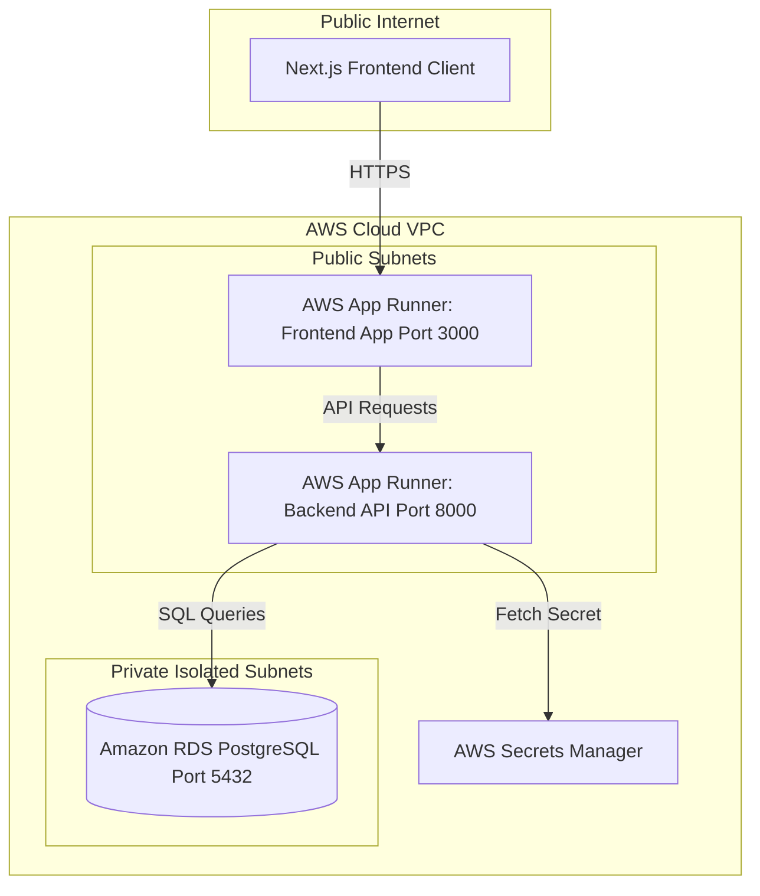

# Chakravyuha — Daily DSA Challenge Platform

Welcome to the **Chakravyuha Daily DSA Challenge Platform**! This repository hosts a customized web application designed for managing topic-wise problem sheets, monitoring daily attendance, and maintaining super-admin oversight with a premium Mahabharata battlefield aesthetic.

---

## 🏛️ Project Architecture
The platform is organized into two core layers:
* **`backend/`**: FastAPI (Python) server handling SQLite auto-migration, JWT authentication, OpenPyXL styled Excel exports, and real-time validations.
* **`frontend/`**: Next.js 14 client built with Next App Router, Lucide icons, custom responsive dashboards, and camera QR scanning overlays.

---

## 🚀 Port Assignments & URL Addresses

* **Client Application**: `http://localhost:3000` (Web UI interface)
* **Backend API Gateway**: `http://localhost:8000` (Swagger docs available at `http://localhost:8000/docs`)

---

## 🔒 Platform Credentials

To ensure a clean dashboard for user testing, **all mock student data and registration logs have been cleared**. The database is initialized with the following production admin accounts:

### 1. Scan Admins (Access restricted to Scanner page `/admin/scan` only)
* **Passcode (Common for all)**: `scan@admin321`
* **Supported Login Usernames / Emails**:
  * `satya_shivani` (or `satya_shivani@chakravyuha.edu`)
  * `rithvik` (or `rithvik@chakravyuha.edu`)
  * `pranavi` (or `pranavi@chakravyuha.edu`)
  * `akhila` (or `akhila@chakravyuha.edu`)
  * `lalith_aditya` (or `lalith_aditya@chakravyuha.edu`)
  * `gayatri` (or `gayatri@chakravyuha.edu`)
  * `karthik` (or `karthik@chakravyuha.edu`)

### 2. Super Admins (Full platform access: `/admin/super` & `/admin/scan`)
* **Passcode (Common for all)**: `super@admin321`
* **Supported Login Usernames / Emails**:
  * `mithra` (or `mithra@chakravyuha.edu`)
  * `rudrabhishek` (or `rudrabhishek@chakravyuha.edu`)
  * `hari_kiran` (or `hari_kiran@chakravyuha.edu`)
  * `krishna` (or `krishna@chakravyuha.edu`)
  * `maneesh` (or `maneesh@chakravyuha.edu`)
  * `sindhuja` (or `sindhuja@chakravyuha.edu`)
  * `ganesh` (or `ganesh@chakravyuha.edu`)

---

## 🛠️ Step-by-Step Setup Guide

### 1. Backend Server Setup
From the repository root, execute the following commands in your shell:
```bash
# Navigate to the backend directory
cd backend

# Activate the virtual environment
.\venv\Scripts\activate

# Install requirements
pip install -r requirements.txt

# Start the FastAPI server using Uvicorn
python -m uvicorn backend.main:app --host 127.0.0.1 --port 8000
```

### 2. Frontend Next.js Client Setup
Open a separate terminal window and run:
```bash
# Navigate to the frontend directory
cd frontend

# Install Node.js dependencies
npm install

# Spin up the Next.js development client
npm run dev
```

---

## 🌟 Premium Features Summary

### 1. Direct-URL Inline Auth Prompts
Administrators bookmarking or navigating directly to `/admin/scan` or `/admin/super` will not be kicked back to the landing page. Instead, they will be greeted with an inline **"Authentication Required"** form. Entering correct credentials immediately unlocks the view.

### 2. Multi-Scanner Real-Time Synchronization
Attendance record cards automatically poll the server every **3 seconds**. When multiple Scan Admins scan students on different devices, the checked-in table logs refresh in real-time across all active dashboard displays.

### 3. Scan Admin CRUD Directory (Super Admin Only)
Super Admins can manage (register/remove) scanner roles from a dedicated **"Scan Admins"** dashboard tab. Adding a scanner admin automatically hashes their passwords and generates a secure scanner key.

### 4. Audio Beep Synthesizer
Webcam QR scans utilize the browser `AudioContext` API to generate distinct frequencies (high-pitch success beep, low-pitch error buzz) to confirm check-ins without loading heavy media files.

### 5. Styled openpyxl Excel Reports
Super Admins can download high-fidelity spreadsheets containing student progress summaries. These spreadsheets are custom styled with corporate gold `#8C7030` header fills, font hierarchies, bordered cells, and auto-scaled columns.

### 6. Live Validation Checks
* **Domain Check**: Blocks public email providers (gmail, yahoo, outlook) to enforce institutional student email registrations.
* **Format Regex**: Student roll numbers are validated on the fly against formats like `AV.SC.U4CSE23233` (allowing periods).

---

## ⚡ Power Automate Webhook Integration (Step-by-Step)

Follow these instructions to configure Microsoft Power Automate to dynamically construct and deliver a beautiful HTML email containing the warrior's registration QR code immediately upon signup.

### Step 1: Create the Flow Trigger
1. Log in to [Power Automate](https://make.powerautomate.com/).
2. Select **Create** -> **Instant cloud flow**.
3. Skip the dialog and select the **"When an HTTP request is received"** trigger.
4. Set the trigger to use the **POST** method (found under Show Advanced Options).
5. In the **"Request Body JSON Schema"**, paste the following schema structure:
```json
{
  "type": "object",
  "properties": {
    "email": { "type": "string" },
    "full_name": { "type": "string" },
    "roll_number": { "type": "string" },
    "qr_key": { "type": "string" },
    "qr_image_url": { "type": "string" }
  }
}
```

### Step 2: Add Email Dispatch Action
1. Click **+ Next Step** and search for **"Send an email (V2) - Office 365 Outlook"** (or Gmail connector if using public SMTP).
2. Configure the action properties:
   * **To**: Click **"Add dynamic content"** and select the `email` property.
   * **Subject**: `🛡️ Chakravyuha DSA Challenge — Your Warrior QR Code`
   * **Body**: Click the **"Code View"** button `</>` in the text editor and insert the styled HTML template below:
```html
<div style="font-family: 'Helvetica Neue', Helvetica, Arial, sans-serif; max-width: 600px; margin: auto; background-color: #0c0a09; color: #e4e4e7; padding: 40px 30px; border: 1px solid #c5a059; border-radius: 8px;">
  <h1 style="color: #d4af37; text-align: center; text-transform: uppercase; letter-spacing: 2px; font-family: 'Georgia', serif; font-size: 28px; margin-bottom: 5px;">CHAKRAVYUHA</h1>
  <p style="text-align: center; font-size: 10px; text-transform: uppercase; color: #a1a1aa; letter-spacing: 3px; margin-top: 0; margin-bottom: 25px;">Daily DSA Challenge Battlefield</p>
  <hr style="border: 0; border-top: 1px solid #27272a; margin: 25px 0;" />
  
  <p style="font-size: 14px; line-height: 1.6;">Hail Warrior <strong>@{triggerBody()?['full_name']}</strong>,</p>
  <p style="font-size: 14px; line-height: 1.6; color: #a1a1aa;">Your registration is successful. Below are your unique battlefield credentials:</p>
  
  <div style="background-color: #1c1917; border-left: 3px solid #d4af37; padding: 15px; margin: 20px 0; border-radius: 4px;">
    <table style="width: 100%; font-size: 13px; color: #e4e4e7; border-collapse: collapse;">
      <tr>
        <td style="padding: 4px 0; font-weight: bold; width: 120px; color: #c5a059;">Roll Number:</td>
        <td style="padding: 4px 0; font-family: monospace;">@{triggerBody()?['roll_number']}</td>
      </tr>
      <tr>
        <td style="padding: 4px 0; font-weight: bold; color: #c5a059;">College Email:</td>
        <td style="padding: 4px 0;">@{triggerBody()?['email']}</td>
      </tr>
      <tr>
        <td style="padding: 4px 0; font-weight: bold; color: #c5a059;">Battlefield Key:</td>
        <td style="padding: 4px 0; font-family: monospace; color: #38bdf8;">@{triggerBody()?['qr_key']}</td>
      </tr>
    </table>
  </div>
  
  <p style="font-size: 14px; line-height: 1.6; text-align: center; color: #a1a1aa; margin-top: 30px;">
    Your Permanent Attendance QR Code Credential:
  </p>
  <p style="text-align: center; margin: 20px 0;">
    
  </p>
  
  <p style="font-size: 12px; font-style: italic; color: #71717a; text-align: center; margin-top: 30px;">
    Present this QR Code daily at the battlefield scanner to record your attendance check-in.
  </p>
</div>
```
3. Save the flow. Copy the newly generated **"HTTP POST URL"** from the trigger.

### Step 3: Link FastAPI to the Webhook URL
To make the backend invoke your flow:
1. In your local backend server environment, configure the following environment variable with the copied URL:
   * **Windows Powershell**:
     ```powershell
     $env:POWER_AUTOMATE_SIGNUP_WEBHOOK_URL="PASTE_YOUR_POWER_AUTOMATE_HTTP_POST_URL_HERE"
     ```
2. Restart the FastAPI server. New sign-up operations will now immediately trigger the webhook and deliver the formatted email!

---

## ☁️ AWS Cloud Production Deployment Guide

This guide details a step-by-step, secure, production-grade deployment of the Chakravyuha platform to Amazon Web Services (AWS) using **Amazon RDS (PostgreSQL)**, **AWS Secrets Manager**, **Amazon ECR**, and **AWS App Runner** (or **Amazon ECS Fargate**).



---

### 🚀 Local Multi-Container Deployment (Docker Compose)
To test the complete production setup locally:
1. Ensure Docker Desktop and Docker Compose are installed.
2. Spin up both containers:
   ```bash
   docker-compose up --build
   ```
3. The frontend runs at `http://localhost:3000` and the backend gateway runs at `http://localhost:8000`.

---

### 🛡️ Step-by-Step AWS Production Deployment

#### Step 1: Set Up VPC and Security Groups
To ensure database isolation and block unauthorized access:
1. Open the **Amazon VPC Console**.
2. Click **Create VPC** and select **VPC and More**:
   * **IPv4 CIDR block**: `10.0.0.0/16`
   * **Availability Zones (AZs)**: Choose 2 (e.g., `us-east-1a` and `us-east-1b` for high-availability).
   * **Public Subnets**: 2 subnets (for frontend/backend App Runner instance nodes).
   * **Private Subnets**: 2 subnets (fully isolated database subnet layer).
3. Create two **Security Groups**:
   * **`Chakravyuha-Backend-SG`**: Set inbound rules to allow port `8000` from anywhere (`0.0.0.0/0`) or from your custom domain origin.
   * **`Chakravyuha-Database-SG`**: Set inbound rules to allow PostgreSQL port `5432` **strictly** from the source security group `Chakravyuha-Backend-SG`. *This blocks all unauthorized external database login attempts.*

---

#### Step 2: Provision Database Layer (Amazon RDS PostgreSQL)
Create a managed relational database instance:
1. Open the **Amazon RDS Console** and click **Create database**.
2. **Engine Options**: Select **PostgreSQL**.
3. **Templates**: Choose **Production** (or **Free Tier** for sandbox trials).
4. **Settings**:
   * **DB Instance Identifier**: `chakravyuha-dsa-db`
   * **Master Username**: `postgres`
   * **Master Password**: Set a strong, secure passcode (e.g., generated via Password Manager).
5. **Connectivity**:
   * **Virtual Private Cloud (VPC)**: Select the custom `10.0.0.0/16` VPC created in Step 1.
   * **DB Subnet Group**: Select private isolated subnets.
   * **Public Access**: Select **No** (Database remains inaccessible to the public internet).
   * **VPC Security Group**: Select existing group `Chakravyuha-Database-SG`.
6. Click **Create Database** and copy the **Endpoint url** once provisioned.

---

#### Step 3: Configure Environment Credentials (AWS Secrets Manager)
To avoid hardcoding connection tokens:
1. Navigate to the **AWS Secrets Manager Console** and click **Store a new secret**.
2. **Secret type**: Select **Other type of secret**.
3. Create key-value parameters:
   * `DATABASE_URL`: `postgresql://postgres:<PASSWORD>@<RDS_ENDPOINT>:5432/dsa_challenge` *(Replace with your master password and copied RDS endpoint)*
   * `POWER_AUTOMATE_SIGNUP_WEBHOOK_URL`: `https://...` *(Your Power Automate trigger URL)*
4. Name the secret: `/production/chakravyuha` and click **Store**.

---

#### Step 4: Push Container Images to Amazon ECR
Create repositories and push the Dockerized application code:
1. Open the **Amazon ECR Console** and create two private repositories:
   * `chakravyuha-backend`
   * `chakravyuha-frontend`
2. Authenticate your local Docker daemon with ECR (example for `us-east-1`):
   ```bash
   aws ecr get-login-password --region us-east-1 | docker login --username AWS --password-stdin <AWS_ACCOUNT_ID>.dkr.ecr.us-east-1.amazonaws.com
   ```
3. Build, tag, and push the backend container:
   ```bash
   docker build -t chakravyuha-backend ./backend
   docker tag chakravyuha-backend:latest <AWS_ACCOUNT_ID>.dkr.ecr.us-east-1.amazonaws.com/chakravyuha-backend:latest
   docker push <AWS_ACCOUNT_ID>.dkr.ecr.us-east-1.amazonaws.com/chakravyuha-backend:latest
   ```
4. Build, tag, and push the frontend container:
   ```bash
   docker build -t chakravyuha-frontend ./frontend
   docker tag chakravyuha-frontend:latest <AWS_ACCOUNT_ID>.dkr.ecr.us-east-1.amazonaws.com/chakravyuha-frontend:latest
   docker push <AWS_ACCOUNT_ID>.dkr.ecr.us-east-1.amazonaws.com/chakravyuha-frontend:latest
   ```

---

#### Step 5: Deploy the Backend API Gateway (AWS App Runner)
Deploy the FastAPI backend:
1. Navigate to the **AWS App Runner Console** and click **Create service**.
2. **Source**: Select **Container registry** and choose **Amazon ECR**.
   * **Container Image URI**: Browse and select `chakravyuha-backend:latest`.
   * **Deployment Settings**: Select **Automatic** (Auto-rebuilds and deploys when new tags are pushed).
3. **Configure Service**:
   * **Service Name**: `chakravyuha-backend-service`
   * **Port**: Configure App Runner to listen on port `8000`.
   * **Environment Variables**: Reference keys from Secrets Manager:
     * `DATABASE_URL`: `{{resolve:secretsmanager:/production/chakravyuha:SecretString:DATABASE_URL}}`
     * `POWER_AUTOMATE_SIGNUP_WEBHOOK_URL`: `{{resolve:secretsmanager:/production/chakravyuha:SecretString:POWER_AUTOMATE_SIGNUP_WEBHOOK_URL}}`
   * **Health Check**:
     * **Protocol**: `HTTP`
     * **Path**: `/api/health` (FastAPI health checker)
4. Under **Networking**, select **Custom VPC Configuration** to link the backend into your VPC, allowing it to talk to the RDS database in the private subnet.
5. Create the service and record the **Public service URL** (e.g. `https://xxxxxx.us-east-1.awsapprunner.com`).

---

#### Step 6: Deploy the Frontend Application (AWS App Runner)
Deploy the Next.js client pointing to the backend API endpoint:
1. Create a new App Runner service pointing to **Amazon ECR** -> `chakravyuha-frontend:latest`.
2. **Configure Service**:
   * **Service Name**: `chakravyuha-frontend-service`
   * **Port**: Configure App Runner to listen on port `3000`.
   * **Environment Variables**:
     * `NEXT_PUBLIC_API_URL`: Your deployed backend service URL from Step 5 (e.g., `https://xxxxxx.us-east-1.awsapprunner.com`).
3. Click **Create and deploy**.

---

#### Step 7: Domain Association and SSL/HTTPS (Route 53 & ACM)
Enforce encrypted SSL channels for secure scanning operations:
1. Under your App Runner service dashboard, navigate to **Custom Domains** and click **Link Domain**.
2. Enter your custom domain name (e.g., `chakravyuha.club` or `challenge.chakravyuha.club`).
3. App Runner will generate DNS validation records (CNAME). Add these CNAME records to your registrar DNS Zone (or AWS Route 53 Hosted Zone) to generate free, managed SSL certificates.
4. Once validated, all platform interactions, camera scanning APIs, and administrative control panels will run securely over encrypted **HTTPS**.
